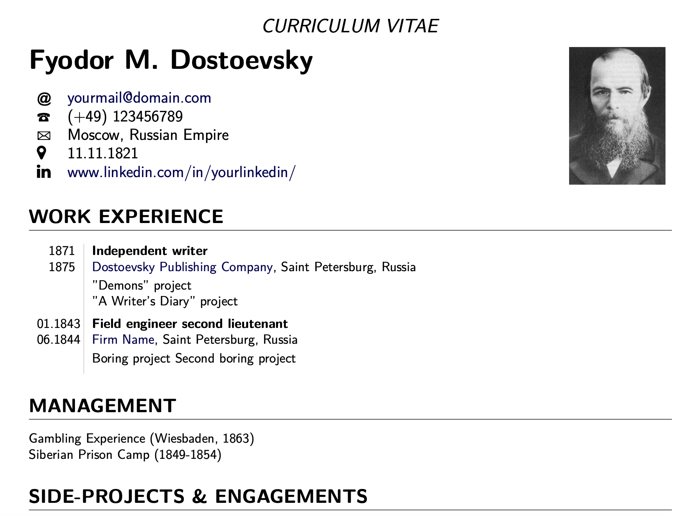

# Latex templates

Custom LaTeX template for a CV. 




``` bash
cd cv
lualatex -synctex=1 -interaction=nonstopmode latex_cv.tex
```

## Authors

- [vvkorz](https://github.com/vvkorz)

## License

This project is licensed under the MIT License - see the [LICENSE.md](LICENSE) file for details
